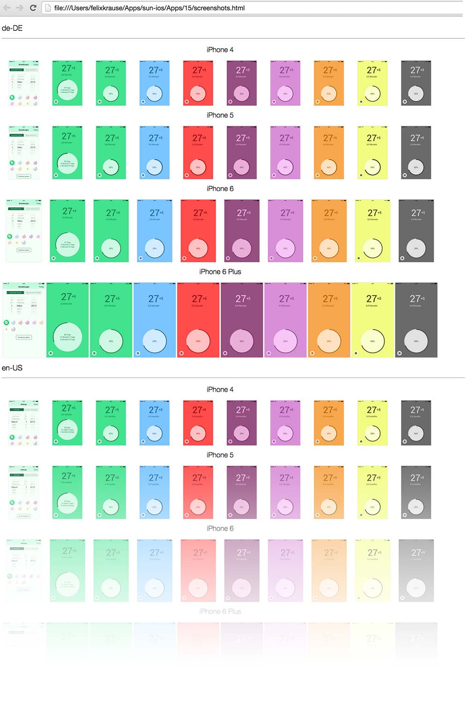
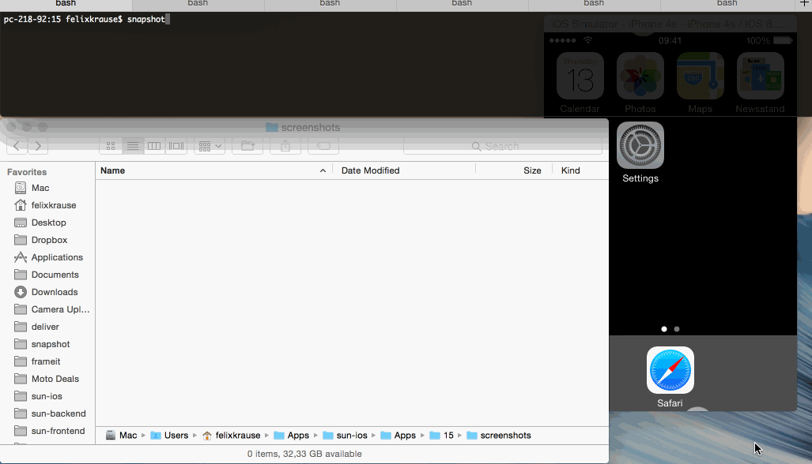

# fastlane screenshots for iOS and tvOS

Taking screenshots of your app and then preparing them for display is time consuming, and it's hard to get everything right and consistent!

- Is your latest app design inconsistent with the screenshots from your store page?
- Is your app localized into many languages that require different screenshots for each?
- Have you made sure that no loading indicators are showing?
- Is the same content displayed for each of your size variations?

If you manually take screenshots of your app for many screen sizes, orientations, and locales, fastlane can save you a lot of time by having `snapshot` run through all combinations of devices and locales without any intervention!

If you put your screenshots into device frames for display on the App Store or your own website, fastlane can be your automated design department by decorating each screenshot with a device frame and other text in the colors and fonts of your choice!

# Automated Screenshot Capture

`snapshot` works with fastlane to automate the process of capturing screenshots of your app. It allows you to:

- Capture hundreds of screenshots in multiple languages on all simulators
- Do something else while the computer takes the screenshots for you
- Configure it once, and store the configuration so anyone on the team can run it
- Generate a beautiful web page showing all screenshots on all devices. This is perfect to send to Q&A, marketing, or translators for verification
- Avoid having loading indicators in your App Store screenshots by intelligently waiting for network requests to be finished

After `snapshot` successfully captures all the screenshots, it will show you a beautiful HTML page to summarize all the screens that were captured:



### Getting Started Using UI Tests

`snapshot` uses the capabilities of Apple's UI Tests to drive interactions with your app. To get familiar with writing UI Tests, check out the following introductions:

- [WWDC 2015 Introduction to UI Tests](https://developer.apple.com/videos/play/wwdc2015-406/)
- [A first look into UI Tests](http://www.mokacoding.com/blog/xcode-7-ui-testing/)
- [UI Testing in Xcode 7](http://masilotti.com/ui-testing-xcode-7/)
- [HSTestingBackchannel : ‘Cheat’ by communicating directly with your app](https://github.com/ConfusedVorlon/HSTestingBackchannel)
- [Automating App Store screenshots using fastlane snapshot and frameit](https://tisunov.github.io/2015/11/06/automating-app-store-screenshots-generation-with-fastlane-snapshot-and-sketch.html)

To jump-start your UI tests, you can use the UI Test recorder. By interacting with your app through the simulator while using it, Xcode will generate UI Test code for you. You can find the red record button on the bottom of the screen, and there's more information in [this blog post](https://krausefx.com/blog/run-xcode-7-ui-tests-from-the-command-line)

### Setting Up snapshot

1. Create a new UI Test target in your Xcode project (See the top part of [this article](https://krausefx.com/blog/run-xcode-7-ui-tests-from-the-command-line))
1. Run `snapshot init` in your project folder
1. Add the **./SnapshotHelper.swift** to your UI Test target (You can move the file anywhere you want)
1. (Objective C only) add the bridging header to your test class.
    - `#import "MYUITests-Swift.h"`
    - The bridging header is named after your test target with -Swift.h appended.
1. In your UI Test class, click the `Record` button on the bottom left and record your interaction
1. To take a snapshot, call the following between interactions
    - Swift: `snapshot("01LoginScreen")`
    - Objective C: `[Snapshot snapshot:@"01LoginScreen" waitForLoadingIndicator:YES];`
1. Add the following code to your `setUp()` method:

**Swift**

```swift
let app = XCUIApplication()
setupSnapshot(app)
app.launch()
```

**Objective C**

```objective-c
XCUIApplication *app = [[XCUIApplication alloc] init];
[Snapshot setupSnapshot:app];
[app launch];
```



You can try the `snapshot` [example project](https://github.com/fastlane/fastlane/tree/master/snapshot/example) by cloning this repo.


# Decorate Screenshots with Device Frames

To be written soon, this will contain

- Overview of the different methods of screenshots
- Getting started with snapshot
- Getting started with frameit

